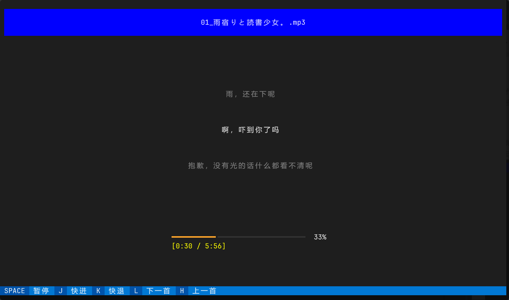
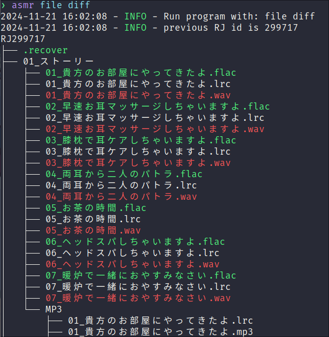

# ASMRManager

包含下载，管理，播放(命令行 TUI)的 <https://asmr.one> 的 CLI 管理工具。

## 功能介绍

### 下载

支持网站所支持的所有索引方式(关键词，标签，会社，价格，声优，日期，年龄分级等等)以及排序方式。
目前仅支持调用 IDM 或 aria2 下载。
支持根据根据文件名对下载的文件进行过滤，以及对音频文件的格式转换。

```
> asmr dl search --help
2024-02-27 16:54:42 - INFO - Run program with: dl search --help
Usage: asmr dl search [OPTIONS] [TEXT]

  search and download ASMR

  the [multiple] options means you can add multiple same option such as:

      --tags tag1 --tags tag2 --no-tags tag3

  for options like --rate, --sell, --price, you should give a interval like:

      --rate 3.9:4.7 --sell 1000: --price :200

  the interval a:b means a <= x < b, if a or b is not given i.e. a: or :b, it
  means no lower or upper limit

  --force will check the download RJ files again though it is already  in the
  database, it work just like update

  --replace option will first delte the original file, then add the new file
  to download queue(i.e. IDM or aria2)

  nsfw will only show the full age ASMRs

  for other --order values, you can refer to the website for explicit meaning

Options:
  -t, --tags TEXT                 tags to include[multiple]
  -nt, --no-tags TEXT             tags to exclude[multiple]
  -v, --vas TEXT                  voice actor(cv) to include[multiple]
  -nv, --no-vas TEXT              voice actor(cv) to exclude[multiple]
  -c, --circle TEXT               circle(社团) to include
  -nc, --no-circle TEXT           circle(社团) to exclude[multiple]
  -a, --age [general|r15|adult]   age limitation to include[multiple]
  -na, --no-age [general|r15|adult]
                                  age limitation to exclude[multiple]
  -r, --rate TEXT                 rating interval
  -s, --sell TEXT                 selling interval
  -pr, --price TEXT               pirce interval
  --all / --select                download all RJs  [default: select]
  -p, --page INTEGER              page of the search result  [default: 1]
  --subtitle / --no-subtitle      if the ASMR has subtitle(中文字幕)  [default:
                                  no-subtitle]
  -o, --order [create_date|rating|release|dl_count|price|rate_average_2dp|review_count|id|nsfw|random]
                                  ordering of the search result  [default:
                                  release]
  --asc / --desc                  ascending or descending
  --force / --check-db            force download even if the RJ id exists in
                                  database,or by default, RJ already in the
                                  database will be skipped
  --replace / --no-replace        replace the file if it exists  [default: no-
                                  replace]
  --check-name / --ignore-name    check and filter out asmr by filenames,
                                  rules are in the config file  [default:
                                  check-name]
  --check-tag / --ignore-tag      check and filter out asmr by tags, rules are
                                  in the config file  [default: check-tag]
  -h, --help                      Show this message and exit.
```

### 管理

可以对作品进行评分，评论。也支持用关键词进行搜索(但需要一点 sql 基础，仓库提供了一些模板，例如 [search.sql](./asmrmanager/filemanager/resources/sqls.example/search.sql))

### 播放

非常简陋的终端播放界面，支持歌词显示，按照歌词信息快进，切换歌曲，支持以pygame(sdl)或mpd做为后端，可以预见的将来应该会完善一下(但感觉够用了应该不会再加啥功能了)。


## 使用方法

本工具支持 `python >= 3.10`, 安装方法如下：

```shell
pip install ASMRManager[依赖]
```

可选则的依赖项有 `idm`, `aria2`, `tui`，`pygame`,`mpd`, `all`，多个依赖使用逗号分隔，其中`all`为安装所有依赖。例如 `pip install ASMRManager[idm,tui]`

- 下载：`idm` 或 `aria2` 二选一，`idm` 为 windows 平台专用，`aria2` 为跨平台。
- 播放：`pygame` 或 `mpd` 二选一。
- 其他：`tui` 为可视化命令行界面。

> 此处也可以选择使用 `pipx` 来替代 `pip`，避免污染全局环境。
> 安装方法：`pip install pipx`

---

之后再运行 `asmr` 命令，会生成示例的配置文件和 sql 文件，此处以 windows 举例：

```
2023-10-22 14:36:21 - INFO - First time to run, copy default sqls to C:\Users\slqy\AppData\Local\asmrmanager\asmrmanager\sqls
2023-10-22 14:36:21 - INFO - An example config file has been copied to C:\Users\slqy\AppData\Local\asmrmanager\asmrmanager\config.toml, please modify it and run this command again
```

之后按照说明修改 `config.toml` 文件，如果使用 sql 的话，也可以对 sql 文件夹进行修改。

若有不明白的地方可使用 sqlite 数据库工具查看目录下的 data.db 文件。

完成后使用 `asmr -h` 查看各命令的使用说明，对于子命令不清楚的同样可以查看帮助，例如 `asmr dl -h`。
常用的命令有：
- `dl search` 搜索并下载。
- `info` 搜索某个 RJID 的具体信息
- `file check` 检查下载目录下的文件是否按照规则被正确下载 
- `file store` 将下载文件转移到存储目录(STORAGE_PATH)，并执行相应文件格式转换(详情见config.toml的before_store字段)
- `view` 将选择文件并移动到 VIEW_PATH
- `pl add` 将某个音声添加到用户的云端播放列表(配合 `pl create` 使用)
- `review` 为某个作品评分并评论(本地)

更多使用示例可参考[这一小节](#使用示例)。

> 使用命令时，如果不输入 RJID ，将会自动使用上一次命令的RJID。

另外本工具提供基于 `trogon` 的可视化命令行界面，在安装`tui`依赖后使用 `asmr tui` 即可打开。

## 命令行补全
仅适用于Linux，详情可参考[官方文档](https://click.palletsprojects.com/en/8.1.x/shell-completion)。
```shell
# fish
_ASMR_COMPLETE=fish_source asmr > ~/.config/fish/completions/asmr.fish

# bash
_ASMR_COMPLETE=bash_source asmr > ~/.asmr-complete.bash
echo '. ~/.asmr-complete.bash' >> ~/.bashrc

# zsh
_ASMR_COMPLETE=zsh_source asmr > ~/.asmr-complete.zsh
echo '. ~/.asmr-complete.zsh' >> ~/.zshrc
```

## 使用示例
搜索最近更新的40个(一页)作品并下载：
```shell
asmr dl search -o release --desc  # 选择并下载
asmr dl search -o release --desc --all  # 下载全部
```

下载`治愈`标签下销量大于等于5000的全部的作品：
```shell
asmr dl search --tags 治愈 --sell 5000: --page 0 --all  # --page 0 会遍历下载所有页，否则默认只会下载第一页
```

下载某个社团下的全年龄并包含中文字幕的作品：
```shell
asmr dl search --circle Yostar --age general --subtitle
```

根据RJ/VJ/BJ号下载（下述输入格式适用于一切需要输入单个或多个ID的场合）：
```shell
asmr dl get RJ299717
asmr dl get 299717  # RJ可以省略；对于8位RJ号，第一位的0也可以省略
asmr dl get VJ015443
asmr dl get 100000029  # 对于BJ与VJ，网站为了兼容RJ所使用的特殊ID
asmr dl get 300015443  # 本项目存储VJ与BJ所使用的ID（"3" + 8位VJ号，BJ则为"4" + 8位BJ号）
```

检查下载目录下文件是否下载完全（只验证文件存在，不保证文件完整性）
```shell
asmr file check
asmr file check --list | xargs asmr dl get --force   # 重新下载所有不完整的文件，以linux shell为例
```

将下载的文件转移到存储目录(STORAGE_PATH)，并执行相应文件格式转换(详情见config.toml的before_store字段)
```shell
asmr file store --all
```

比较本地文件与服务器文件的差异：



简单的关键词搜索（本地数据库）：
```shell
asmr query 治愈 --limit 3  # 搜索字段有：标题，社团名和标签名
asmr query 治愈 --limit 3 --raw | jq .[].id | xargs -n1 asmr info # 输出为json格式，获取详细信息
```


## 关于`dl search/get`的使用
命令执行过程中会进行如下的检查与过滤操作：
1. 开始下载前：检查RJ号是否应该下载，如果本地文件不存在或者数据库无记录都会执行下载操作。可以通过 `--force` 强制执行下载。
1. 获取音声信息后：检查音声的tags，如果包含tag_filters里指定的tag，则跳过下载。可以通过 `--ignore-tag` 来强制下载。
1. 获取下载文件后：检查文件的名称和路径，如果不符合filename_filters里指定的规则，则跳过下载。可以通过`--ignore-name`来强制下载。
1. 添加下载任务时：如果检测到本地有同名文件，则跳过该文件的下载。可以通过`--replace`来强制覆盖存在的文件。

## 其他

感谢 <https://asmr.one>丰富了我的夜生活。
另外网站运营不易，请合理使用本工具。
